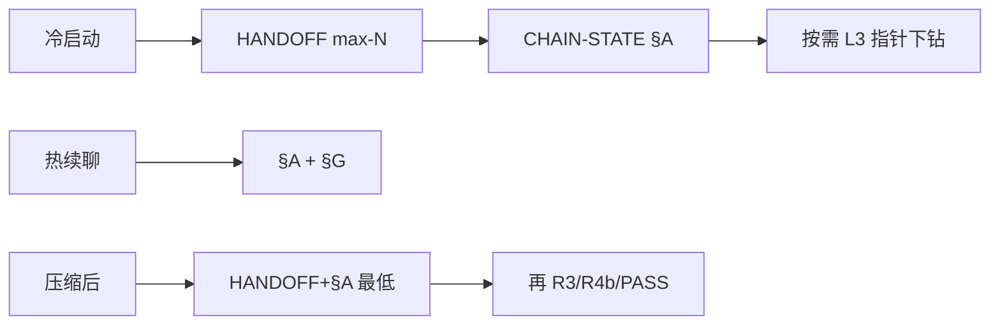

# 主帅上下文生命周期管理协议 v2

**范围**：解决主帅（+1）窗口因信息汇聚导致的上下文膨胀、幻觉、遗忘与形状漂变。同时覆盖蜂群（M 级 / L2）与军团（L 级 / L3）场景。

**不替代**：`CLAUDE.md §二` 底线（写码回合 R3+R4a+R4b、R4 实测门禁、可验证分级等）不受影响。

## 1. 三层上下文模型

| 层 | 名称 | 预算 | 内容 | 刷新策略 |
|---|---|---|---|---|
| **L1** | Working Memory | ≤30k tok（蜂群）/ ≤45k tok（军团） | 当轮 delta、用户最近 2 轮原文、pinned 骨架、R4 冻结清单、活跃 Task 回流 | 每轮统帅扫描；>预算时按 staleness 驱逐至 L2 |
| **L2** | Episodic（CHAIN-STATE.md） | ≤8k tok | 全量 active 冻结条、Gate 裁决、COND 追踪、EP 归档指针、superseded 墓碑 | Phase 切换 / Gate 通过时 working→episodic 压缩 |
| **L3** | Semantic（磁盘） | 无上限 | RECENT-DECISIONS、EP 完整产出、raw tool output、archived 冻结条全文、pinned 全文备份 | append-only；新会话按需 Read |

**预算守恒**：L1 + L2(≤8k) + CLAUDE.md 税(~7.5k) + 系统开销 ≤ **60k** 有效 token。

**依据**：Claude Code 实际质量拐点 ~120k token，扣除系统指令与规则注入后有效空间约一半。

### 1.1 XWM（外置结构化工作记忆）术语与权威序

- **定义**：**XWM** = **外置结构化工作记忆**——将契约、进度、冻结条与验收状态**结构化落盘**；主帅窗口以 **delta + 路径指针** 为主，按需 **Read** 外存，以 **Task 转包** 承载大块推理，从而**扩充可审计状态容量**并**减轻对话 token 压力**。
- **禁用裸 `SSM`** 作为本概念的简称，避免与 **S/M/L 规模档**、机器学习 **State-Space Model**、**AWS Systems Manager** 等混淆；文档中若出现字母组合 `SSM` 须明示非 XWM 或写外文全名。
- **单一 L2 权威**：链上可复核执行状态以本链 **`CHAIN-STATE.md`**（§A 精简下限与 §B 等）为准；移植摘要、聊天复述、外部一览表**不得**与之并列成第二权威源。
- **军令状优先（军团）**：`MISSION-BRIEF` 及含 **`[PENETRATING]`** 的原文节与 `CHAIN-STATE` 指针一致时，**优先于**衍生表与口头汇流。
- **冲突**：外置摘要与 `CHAIN-STATE`/军令状矛盾时，以**落盘文件**为准，并修正摘要或指针。
- **移植入口**：`.claude/swarm/PORTING-PROMPT-XWM.zh-CN.md`（免责 + 可复制提示词；**不替代**`CLAUDE.md §二` 与军团 PORTING 族）。

### 1.2 可选进阶外置：L1 镜像、Sub-agent 回流、口头结论（XWM+）

以下三条默认主要在**对话内（L1）或瞬时 Sub-agent 桶**中，**不自动落盘**；在**长对话、强压缩、多轮 Task** 场景下，推荐**可选启用**外置镜像，进一步减压并防漂变。**不改变** L2 仍以 `CHAIN-STATE.md` 为契约主锚；镜像文件是**从属证据与接力草稿**，与 §A/§B 冲突时以 `CHAIN-STATE`（及军令状）为准。

| 对象 | 推荐外置形态 | 路径约定（蜂群；军团将 `chains/` 换为 `legion/chains/`） | 写入责任 |
|------|----------------|----------------------------------------------------------|----------|
| **L1 工作记忆** | 当轮「仍在推理中、尚未升格为冻结条」的草稿与关键词 | `{CHAIN-DIR}/L1-MIRROR.md`，**按轮追加**区块（`### ROUND=n` + 时间戳 + ≤400 字要点） | **主帅（+1）**；可与 §G delta 二选一或双写（双写须避免矛盾） |
| **Sub-agent 独立上下文** | Task **关门后**的输入要点 + 输出要点 + 指针（**非**子代理全程脑内过程） | `{CHAIN-DIR}/task-reflux/{ROUND}-{ROLE}.md`（或同目录 `reflux-ROUND-ROLE.md`） | **主帅**在收 Task 后**立即**据回流格式写入；军团 EP 已有 `artifacts/{EP}-{ROLE}-DELIVERY.md` 时**以 artifacts 为主**，本目录仅补**蜂群 R1–R4** 或非 EP 的 Task |
| **口头结论（未落盘）** | 用户在对话中拍板、主帅口述「已冻结」但未进 §B 的句子 | **同一轮内**写入 `CHAIN-STATE.md` §B（新冻结条）或 `RECENT-DECISIONS.md` 一行简报；禁止仅留在聊天 | **主帅**；若尚属待核实标 **B** 并写清依据 |

**注意**：Sub-agent **无法**被平台持久化「整桶上下文」；外置的是**统帅可复核的摘要与指针**，下一轮 Task 仍须 **最小充分 + 指针**，不可默认「子代理记得」。

## 2. CHAIN-STATE.md（工作记忆锚点）

**路径**：
- 蜂群链：`.claude/swarm/chains/{CHAIN-ID}/CHAIN-STATE.md`
- 军团链：`.claude/swarm/legion/chains/{CHAIN-ID}/CHAIN-STATE.md`

**模板**：`.claude/swarm/chains/_CHAIN-STATE-TEMPLATE.md`

**精简下限**：前 20 行（§A 区）包含目标句、验收裁决、active P0、三字段。统帅仅 Read 此区即可回答三项关键问题。

### 2.1 schema 七区

| 区 | 内容 | 适用 |
|----|------|------|
| §A | 精简下限区（目标句+P0+裁决+三字段+ROUND） | 蜂群+军团 |
| §B | 冻结条（四态生命周期） | 蜂群+军团 |
| §C | Gate 裁决区 | 仅军团 |
| §D | COND 追踪区（≤8 条 open 硬上限） | 蜂群+军团 |
| §E | 军令状指针区（pinned_level） | 仅军团 |
| §F | EP 归档区 | 仅军团 |
| §G | 最近 2 轮 delta | 蜂群+军团 |

蜂群模式下 §C/§E/§F 为空；schema 兼容，无需分两套模板。

## 3. 增量 delta 汇流

**替代**全量重述型「续聊任务状态」。每轮汇流末尾使用增量格式：

```
**Δ ROUND={N}**
- [+] 新增冻结条: FC-{ID} "{摘要}" [A/B/C]
- [~] 变更: FC-{ID} active→superseded, 替代=FC-{新ID}
- [=] 验收: TC-E-001 PASS, TC-B-002 OPEN→PASS
- [!] 待决新增: {内容}
- [!CONFLICT] 矛盾: {描述} vs {已冻结条指针}
- [→] 下轮: R3 resume AgentID=xxx; R2 待核 {问题}
```

### 不可省段（每轮必出现）

- 目标句首行回显
- active P0 状态变更
- 验收裁决变更
- 三字段变更（若有）

### 「继续」与 CHAIN 延续（与`CLAUDE.md §二`「统帅分发协议」④ 对齐）

- 用户仅说「继续 / 接着」且**未**新指 `CHAIN-ID` 时，delta 与后续编辑**默认**绑定**上一轮已点名链**（以 §A **`CHAIN-ID`**、Task **`CHAIN=`**、`runs/<CHAIN-ID>/META.md` 或用户原文为准；纯推断标 **B** 并首段一句依据）。
- 拟改**第二条链**、**`runs/_TEMPLATE-*`** 或**跨链 README** 时，须**先向用户一句确认**（或当轮已明示多链/模板授权）；**禁止**凭「继续」静默扩 scope。

### 可省段

- 未变化的冻结条正文
- 已 PASS 的 TC 详情
- archived / superseded 条目

## 4. 冻结条生命周期（四态）

| 状态 | 含义 | 转换条件 |
|------|------|----------|
| **active** | 当前有效 | 新建或恢复 |
| **superseded** | 被新条替代 | 统帅显式声明 + 指向替代条 ID |
| **archived** | 不再相关 | compaction 时仅留 1 行墓碑；墓碑 >20 行时批量清除到最近 5 行 |
| **invalidated** | 被 BREAKING 变更推翻 | 关联 Gate 裁决同时标 invalidated，须重验 |

## 5. 周期快照（触发条件，三选一先到先触发）

1. **轮次驱动**：每 3 轮蜂群回合
2. **token 估算**：主对话估算消耗 ≥50k token
3. **事件驱动**：FAIL 重跑、CHAIN 切换、用户明示「存档」

**compaction 后验证**：统帅须 Read `CHAIN-STATE.md` §A 区，确认 active P0 数量未变且目标句未丢。

## 6. EP 归档协议（军团核心）

### 6.1 Task 回流格式约束

嵌入每个 EP 角色 Task 正文尾部：

```
=== 回流格式约束 ===
你的最终回复须≤800字，结构如下：
1. 【结论】≤3条，每条≤50字，标A/B/C
2. 【交付物指针】落盘路径列表
3. 【下游依赖】须传递给哪个EP的哪些字段
4. 【风险/待决】≤2条
禁止：返回完整源码、raw日志、重复军令状全文
```

### 6.2 归档流程

1. EP Task 返回（≤800 字）
2. 统帅提取结论 → 写入 §B（active 冻结条）
3. 摘要 → 写入 §F（EP 归档区）
4. 完整产出已在 EP 内落盘（L3）
5. Gate 检查 → 放行则下一 EP 读 §F 指针（Gate 签发前须满足下文 **§12** 文件安检）

**落盘路径**：`.claude/swarm/legion/chains/{CHAIN}/artifacts/{EP}-{ROLE}-DELIVERY.md`

## 7. pinned 内容分级摘要（军令状 / 架构 / DAG）

| 级别 | 形态 | ~token | 适用时机 |
|------|------|--------|----------|
| **full** | 完整 Markdown | 2000-4000 | 首轮冻结、架构变更、BREAKING 审查 |
| **skeleton** | 角色名+依赖箭头+穿透条 ID+非目标一句 | 500-800 | 常态执行 |
| **id-only** | `mission:v1 arch:v2 [PENETRATING]:3条` | ~50 | L1 紧张时 |

**降级触发**：L1 > 预算 80% → full→skeleton；> 95% → skeleton→id-only。
**恢复**：用户提及架构/军令状 → 从 L3 Read 回全文。
**校验**：降级时输出 `[PINNED-DOWNGRADE]` 并验证穿透条计数——不匹配则阻塞降级。

## 8. 统帅 L3↔L2 角色切换（沙箱纪律）

| 阶段 | 身份 | L1 持有 |
|------|------|---------|
| **进入 L2 实测前** | 蜂群 +1 | R4a 清单 + 代码路径（≤15k） |
| **L2 实测期间** | 蜂群 +1 | 命令+输出+结果（禁发新 EP Task） |
| **退出回 L3** | 军团统帅 | 恢复军团态 + 实测证据写入 §B |

**诚实说明**：Claude Code 无进程级隔离，此为统帅心智纪律。

## 9. 会话切割与接力

| 信号 | 阈值 | 动作 |
|------|------|------|
| 轮次 | ≥15（军团）/ ≥20（蜂群）| 建议切割（用户可拒） |
| token | ≥50k 估算 | 强烈建议 |
| 死循环 | 同一 P0 连续 3 轮 FAIL | 强制切割 + R1+R2 重入 |

### 切割时写 HANDOFF

路径：`.claude/swarm/chains/{CHAIN-ID}/HANDOFF-R{N}.md`

内容：全量 active 冻结条 + P0 + Gate 进度（军团）+ 最近 2 轮 delta + 下轮指令。

### Cold-start 优先级

`HANDOFF-R{N}.md`（若存在）> `CHAIN-STATE.md` > 从头。

首条回复含「已从 CHAIN={ID} ROUND={N} 接力」，一切以文件为准。

## 10. COND 追踪硬上限

- open 条件 ≤8 条
- 第 9 条到来时，最旧 open → expired + 风险登记（写入 §D + RECENT-DECISIONS）
- expired 条目不计入 8 条配额
- 每条 COND 须含：条件描述、状态、关联 Gate/TC、截止轮次

## 11. Context Poisoning 防御

- 冻结条须标 A/B/C；B/C 不得在后续轮次被引用为「已验证」
- 统帅发现矛盾叙述时须在 delta 中 `[!CONFLICT]` 并指向可核验源
- compaction 时 B/C 条目须重新评估，不得默认升级为 A

## 12. IDE 摘要（Summarize）与关键裁决前的文件安检

**定位**：IDE 对聊天的 **Summarize / 上下文压缩** 仅为**人类可读梗概**，**不构成 A 级**事实源；凡与形状、P0、Gate、穿透verbatim 相关的结论，**须回指磁盘**。

### 12.0 用户口令「记忆接力」（与`CLAUDE.md §二` 对齐）

用户当轮使用 **`记忆接力` / `记接力` / `摘要后接力` / `外存接力` / `磁盘接力`**（同义集合以 `CLAUDE.md` 为准）时，主帅须将该口令视为**强制读盘触发**：在**本轮答复内、任何派单或收口裁决之前**，按 `CLAUDE.md §二` **「记忆接力」专节**的 **Read 序**执行（`HANDOFF`（若存在）→ `CHAIN-STATE` §A → 可选 `L1-MIRROR` / `task-reflux` → 按需 `RECENT-DECISIONS` → 军团则军令状相关节）。**不替代**本节 §12.1–12.3 的安检时点，须**叠加**。外机移植：`.claude/swarm/记忆接力提示词.md`（`PORTING-PROMPT-MEMORY-RELAY.zh-CN.md` 为兼容入口）。

### 12.1 通用（蜂群 + 军团）

- **摘要后或长对话后首轮续干**：优先 **Read** `CHAIN-STATE.md` **§A**（前 20 行）；若链上已有军令状落盘，涉及硬约束/非目标/成功标准时再 **Read** 对应节（或 §E / MISSION-BRIEF 路径）。
- **禁止**：仅凭摘要记忆派发 **R3**、关闭 **R4b**、或宣布 **PASS** / **Shapes 已对齐** 而无 §A 对齐。

### 12.2 蜂群（主帅 +1）

在下列时点**之前**，须完成 **§A Read**（若已维护 `CHAIN-STATE.md`；未维护则须先补最小 §A 或显式声明风险归属）：

- **compaction / 周期快照之后** 的首个派发 **R3 / R4b** Task；
- 用户明示已使用 **Summarize** 或上下文明显为压缩稿后的 **首个写码或验收相关** 派单；
- **同一 P0** 多轮拉扯后的下一轮 **R3**（防编号与裁决漂移）。

### 12.3 军团（Phase Gate）

**签发** Phase Gate 的 **PASS** 或 **COND_PASS** **之前**，军团统帅须：

1. **Read** 本链 `CHAIN-STATE.md` **§A**（含目标句、active P0、三字段若有）；
2. **Read** 军令状中与本轮 Gate 相关的节（冻结目标、硬约束、⑤成功标准、若有 **`[PENETRATING]`** 则须 **原文节** 对齐，不得仅靠回忆）——路径以 **§E** 或链目录下 `MISSION-BRIEF.md` 为准。

**禁止**：仅凭对话摘要或压缩上下文签发放行。微型 Gate（分批批间）仍须至少核对 **§A + 与本轮相关的军令状要点**（可指向具体小节标题）。

### 12.4 Ask 回合与渐进披露（窗口消费协议）

- **Ask 回合**：用户向主帅（+1）发起的一轮提问（含口令、派单前置、或纯答疑）；**不**改变`CLAUDE.md §二` 写码回合与时序闸门。
- **渐进披露**：按**披露深度**递进读盘与进窗，对应 **§1 表**三列语义——**L1 Working**（对话与当轮要点）、**L2 CHAIN-STATE**（§A/§B/§G 等）、**L3 磁盘**（RECENT、EP 全文、archived 等）。**勿与**技能 `16`《蜂群触发路由与形状保持》中的 **「L0–L3 触发分层」**代号混用（二者命名空间无关）。
- **权威序（冷启动）**：与 **§12.0 / `CLAUDE.md §二`「记忆接力」** 一致：**HANDOFF（max-N）→ `CHAIN-STATE` §A →** 按需 L1-MIRROR / task-reflux / RECENT-DECISIONS / 军令状相关节；细则不此处堆长文。
- **热续聊**：同链且 §A 已维护时，本轮优先 **Read §A + §G（delta）**；若对话内已含与 §A/§G **等价**的冻结摘要，可先**核对**再解析用户句。**非**「可跳过 §A」：§A 仍须按轮更新义务维护（见 §3、模板）；契约变更或 **断 resume** 时须在汇流 **一句警示** 并更新指针。
- **Summarize / 压缩后**：**视同须执行与记忆接力等价的 Read 纪律**——在派发 **R3 / R4b** 或宣布 **PASS / COND_PASS / FAIL** 之前，至少完成 **§12.0** 所列序（**最低 HANDOFF（若存在）+ §A**）；**禁止**仅凭压缩梗概派单或收口。**不替代** §A/HANDOFF 的**写入与维护**义务，仅约束**消费侧 Read**。
- **军团**：在上一款基础上叠加 **§E `pinned_level`**（`full` / `skeleton` / `id-only`）控制军令状与架构要点**进窗量**。



## 🔗 技能链条

- [热度权重: 8] `蜂群触发路由与形状保持`（`16`）
- [热度权重: 7] `蜂群可验证结论与跨会话裁决落盘`（`14`）
- [热度权重: 6] `蜂群规则与技能体系维护指南`（`12`）
- [热度权重: 5] `任务驱动型四角色对抗开发工作流`（`09`）
- [热度权重: 4] `上下文快照生成与加载`（`04`，旧版项目快照，本技能为其演进）

**规则锚点**：`CLAUDE.md §二`
