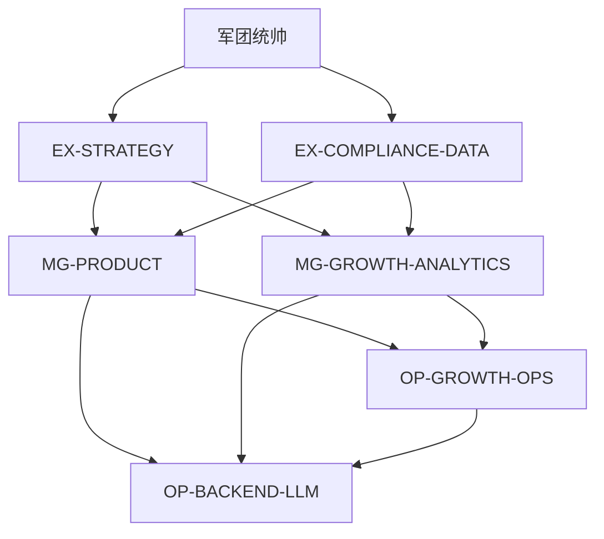

# DAG · EP · I/O — LEGION-ACQ-LLM-001

**CHAIN**：`LEGION-ACQ-LLM-001`  
**冻结时间**：2026-03-29

---

## 1. DAG 邻接表（有向无环）

| -from- | -to- | 说明 |
|--------|------|------|
| 军团统帅 | EX-STRATEGY | EP-0 并行支路 1 |
| 军团统帅 | EX-COMPLIANCE-DATA | EP-0 并行支路 2 |
| EX-STRATEGY | MG-PRODUCT | EP-1 需战略输入 |
| EX-STRATEGY | MG-GROWTH-ANALYTICS | EP-1 |
| EX-COMPLIANCE-DATA | MG-PRODUCT | EP-1 需合规输入 |
| EX-COMPLIANCE-DATA | MG-GROWTH-ANALYTICS | EP-1 |
| MG-PRODUCT | OP-BACKEND-LLM | EP-2 |
| MG-PRODUCT | OP-GROWTH-OPS | EP-2 |
| MG-GROWTH-ANALYTICS | OP-BACKEND-LLM | EP-2（指标/事件契约） |
| MG-GROWTH-ANALYTICS | OP-GROWTH-OPS | EP-2 |
| OP-GROWTH-OPS | OP-BACKEND-LLM | **已采纳（2026-03-29 统帅拍板）** MVP Demo：先交付获客域触发面与契约，再对接 LLM 网关实现端到端；EP-2 内 **OP-GROWTH-OPS Gate 先于** OP-BACKEND-LLM 联调节点（并行开发可行，联调顺序依此边） |

**拓扑波次**

- **EP-0**：EX-STRATEGY ∥ EX-COMPLIANCE-DATA  
- **Gate 0→1**：双 EX《逐级主题汇流块》齐备且矛盾已分类（G/L/O）或收口  
- **EP-1**：MG-PRODUCT ∥ MG-GROWTH-ANALYTICS  
- **Gate 1→2**：双 MG 汇流齐备  
- **EP-2**：OP-BACKEND-LLM 与 OP-GROWTH-OPS **可并行开发**；**联调 / Demo 收口顺序**遵循边 **OP-GROWTH-OPS → OP-BACKEND-LLM**（获客侧先具备可调用契约或 Mock，再与 LLM 层对齐）。  
- **Gate 2→回声**：双叶 OP 蜂群裁决 `PASS` 或合法 `COND_PASS`（见 `CLAUDE.md §二`）

---

## 2. EP 执行简表

| EP | 并行节点 | Gate |
|----|----------|------|
| EP-0 | 双 EX | G0→1 |
| EP-1 | 双 MG | G1→2 |
| EP-2 | 双 OP（各启 L2 蜂群，按需非满编） | G2→回声 |

**并发**：单波 L3 Task 建议 ≤4（与军团规则一致）；双 OP 蜂群内部遵守蜂群闸门。

---

## 3. I/O 契约（骨架）

| 生产者 | 消费者 | 输出物（格式） | 最小字段 |
|--------|--------|----------------|----------|
| EX-STRATEGY | MG-PRODUCT / MG-GROWTH | 战略汇流块（Markdown） | MVP 范围、非目标、优先级、假设 A/B/C |
| EX-COMPLIANCE-DATA | MG-PRODUCT / MG-GROWTH | 合规汇流块 + `[PENETRATING]` | 数据分级、禁止场景、日志/模型边界 |
| MG-PRODUCT | OP-BACKEND-LLM / OP-GROWTH-OPS | PRD 切片 + API 草案 | 资源、错误码占位、LLM 触达点 |
| MG-GROWTH-ANALYTICS | OP-BACKEND-LLM / OP-GROWTH-OPS | 事件/指标字典 | event name、payload 约束、漏斗 id |
| OP-BACKEND-LLM | 统帅 / OP-GROWTH-OPS | OpenAPI 或等价 + 运行证据 | base URL、鉴权、LLM 调用路径 |
| OP-GROWTH-OPS | 统帅 / OP-BACKEND-LLM | 域 API + 验收 TC 指针 | TC-ID、与后端联调前提 |

---

## 4. Task 预算（估算）

| 波次 | L3 节点数 | 备注 |
|------|-----------|------|
| EP-0 | 2 | 双 EX |
| EP-1 | 2 | 双 MG |
| EP-2 | 2 + 2×蜂群 | 叶 OP 各按需 Task，非默认满编蜂群 |

---

## 5. Mermaid（可选渲染）

