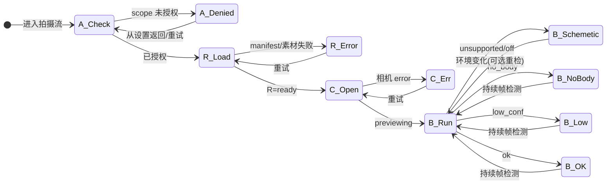

# 《UX 与文案交付》— OP-UX/文案执行员

**首行锚点**：`CHAIN=LEGION-POSE-COACH-001` `ROUND=4` `TIER=OP` `ROLE=OP-UX/文案执行员` `PARENT_REF=EP1-OP-SCENARIO-DONE`

**下游**：EP-3 **OP-小程序**  
**输入指针**：`../MISSION-BRIEF.md`、`MG-UX-PLAN.md`、`OP-SCENARIO-PRD-SLICE.md`、`OP-PRIVACY-COPY-PACK.md`  
**生成日期**：2026-03-27  

---

## 《逐级主题汇流块》

| 字段 | 内容 |
|------|------|
| **本层职责（一句）** | 将 MG 页面契约、场景 US、隐私文案包收敛为 **可施工的线框映射、逐字文案表、聚合状态机** 与 **OP 层 decisions_log**，供小程序实现与验收对表。 |
| **直连上级** | `MG-UX-PLAN.md` §3；`OP-SCENARIO-PRD-SLICE.md`；`OP-PRIVACY-COPY-PACK.md`；军令状（只读）`../MISSION-BRIEF.md`。 |
| **直连下游** | OP-小程序（EP-3）：页面路由/组件态、文案资源 ID、与隐私包字段级一致。 |
| **下级到齐状态** | 三件套已到齐；本交付为 EP-2 收口产出。 |
| **主题摘要** | MVP：首页价值 → 轻量场景选择 → 场景化授权说明 → 相机+示例同框 → 至少一种引导；人体/VK/资源失败走可理解降级（P6/内联）；隐私与权限文案 **仅以隐私包为单一事实源**（本表逐条引用或逐字一致）。 |
| **矛盾与风险** | ① 场景筛选「交集/并集」仍为 **B**（见场景切片），实现拍板后须回写 `decisions_log`。② 首期若无「可选分析」开关，须按隐私包 D-03 **删除或灰显** COPY-PRIV-006 第三段相关 UI。③ 避免「精确评分」话术（军令状④）。 |
| **上送指针** | 本文件；`OP-PRIVACY-COPY-PACK.md` §3–5；`OP-SCENARIO-PRD-SLICE.md` 场景标签表。 |

---

## 硬约束摘录（军令状穿透 · 逐字）

以下两条与 `MISSION-BRIEF.md` 及 `OP-PRIVACY-COPY-PACK.md` §2.1 **一致**，落地不得改写语义。

- [PENETRATING] **隐私与数据**：相机画面默认**仅本地处理**；若上传任何图像/关键点/日志须**明示同意**、最小必要、可关闭；禁止默认上传可识别肖像原图作为「改进产品」的暗默认。

- [PENETRATING] **权限与透明**：`scope.camera` 等权限须配套**场景化说明**；儿童/青少年场景若涉及须单独策略（首期可列为非目标或仅占位文案，但不得误导）。

---

## 线框说明（页面合并映射 P0–P6）

> **原则**：逻辑页面 P0–P6 可按小程序路由合并；下列映射为 **MVP 推荐物理页/壳 + 态**，与 `MG-UX-PLAN.md` §2.1、§2.7 D-MG-005 一致。

| 逻辑 ID | 用户目的 | **推荐物理承载** | 备注 |
|---------|----------|------------------|------|
| **P0** 启动/首页 | 价值一句话、进入主流程、合规摘要入口 | **页面 `home`** | 首访可在 `home` 上以 **全屏/半屏 Modal** 叠 COPY-PRIV-006（首次摘要），或独立子页 `home/privacy-intro`（二选一，实现定）。 |
| **P1** 轻量信息收集 | 场景/目标筛选 | **页面 `scene-pick`** | 与 P0 分离以降低首屏复杂度；从 `home`「开始」进入。 |
| **P2** 相机引导主界面 | 预览 + 示例 + 至少一种引导 | **页面 `coach`**（核心） | **P3**（换 pose）为 `coach` **同页子态**：底部抽屉 / 横向滑动卡片 / 「换姿势」进入浮层，不强制新路由。 |
| **P3** 示例姿势详情/切换 | 更换参照、要点 | **并入 `coach`** | 与 MG「可与 P2 同页不同态」一致。 |
| **P4** 权限与隐私说明 | `scope.camera` 场景化说明；数据流与隐私包一致 | **合并为 `scene-pick` 前置步** 或 **`coach` 授权前全屏说明页** `authorize` | **推荐**：在触发 `wx.authorize` / 打开 `camera` 前，展示 **COPY-PRIV-003 短版**（必现）+ 链到 **`settings/data`** 看长版（COPY-PRIV-004）。独立路由 `privacy-detail` 可选。 |
| **P5** 设置/关于 | 开关占位、版本、反馈 | **页面 `settings`**（含关于子区块或 `settings/about`） | 承载 COPY-PRIV-004 列表化、COPY-PRIV-005/007/008、青少年占位 COPY-PRIV-009。VisionKit/基础库版本 **见 `MG-ENGINEERING-PLAN` / 发布说明**，本交付不写死数字。 |
| **P6** 纯示意模式说明 | 无 VK 或低置信预期 | **`coach` 内 Banner / Modal** | 与 E4/E5 对齐；可重复打开「说明」链到设置长说明。 |

**主路径线框（文字）**

1. `home` →（可选首次 Modal 摘要）→ `scene-pick`  
2. `scene-pick` → 点「去拍摄」→ **P4 授权前说明**（短版 + 按钮「允许使用相机」）→ 系统授权 / 失败分支  
3. 授权成功 → `coach`：左/上 **示例区（L-参照）**，主 **相机区（L-实时）**，下 **短文案提示（L-语义）**，可选 **粗反馈条（L-反馈）**  
4. `coach` 内「换姿势」→ 同页浮层列表（对表 `sceneTags` 过滤结果）  
5. `home` 或 `coach` **设置入口** → `settings`

**关键流程与 MG 对齐**

- **B 权限拒绝**：留在 `scene-pick` 或 `authorize` **错误态区块**（COPY-PRIV-014～016），提供去设置 / 重试。  
- **C 人体失败**：`coach` 内 **P6** + COPY-PRIV-020～022。  
- **D 上传（若未来有）**：独立开关与同意流，不在本 MVP 默认路径假设；文案用 COPY-PRIV-004 条目 3 条件式。

---

## 文案表

**纪律**：隐私/权限/数据流/青少年/非目标边界类文案 **与 `OP-PRIVACY-COPY-PACK.md` 一致**；表中「溯源」列指向该文件章节。非隐私类文案为 OP-UX 基于 US 的信息架构终稿，工程可用 `文案ID` 作 i18n key。

| 文案ID | 场景/状态 | 中文文案 | 备注 |
|--------|-----------|----------|------|
| **COPY-PRIV-003** | 相机授权前 · 短版（≤60 字场景化说明） | 用于在取景框内对照示例姿势并给出拍摄引导；画面默认仅在您的设备上处理，不会默认上传您的照片。 | **逐字**自 `OP-PRIVACY-COPY-PACK.md` §3.1 短版；满足 [PENETRATING] 权限与透明。 |
| **COPY-PRIV-004** | 设置页 · 长版段落（可拆多行展示） | 我们需要使用摄像头，是为了在您拍照时显示实时预览，并把示例姿势与您当前的画面放在一起，方便您调整站位与角度。**默认情况下**，相机画面仅在您的手机上进行处理，用于当次的姿势提示与简单匹配反馈。若未来提供需要把图像、人体关键点或诊断日志上传到服务器的功能，我们会在使用前向您**单独说明用途与范围**，并征得您的**明确同意**；您也可以随时在设置中**关闭**相关能力。我们不会把可识别您个人肖像的原始照片，在未经您同意的情况下默认上传用于「改进产品」。 | **逐字**自 §3.1 长版；与穿透条①一致。首期若无上传能力，可按隐私包 D-02 改为「当前版本不向服务器上传图像」简化版，须 **decisions_log** 记录并与实现对表。 |
| **COPY-PRIV-005** | 设置 · 列表项1 标题 | 相机如何使用 | §3.2 条目式标题。 |
| **COPY-PRIV-005a** | 设置 · 列表项1 正文 | 开启相机后，应用读取摄像头画面用于预览与姿势引导；具体是否使用 VisionKit 等能力以当前版本与机型为准。 | §3.2；版本细节见 `MG-ENGINEERING-PLAN`/发布说明。 |
| **COPY-PRIV-005b** | 设置 · 列表项2 标题 | 数据存放与默认 | §3.2 |
| **COPY-PRIV-005c** | 设置 · 列表项2 正文 | **默认**：处理在本地完成；不向服务器默认上传可识别肖像的原图。 | §3.2 |
| **COPY-PRIV-005d** | 设置 · 列表项3 标题 | 可选上传 / 分析（若产品实现） | §3.2 |
| **COPY-PRIV-005e** | 设置 · 列表项3 正文 | 仅在您打开对应开关并确认说明后，才可能上传；用途限于已告知范围；**最小必要**；可随时关闭。 | §3.2；无此功能时隐藏整块。 |
| **COPY-PRIV-005f** | 设置 · 列表项4 标题 | 日志与排错 | §3.2 |
| **COPY-PRIV-005g** | 设置 · 列表项4 正文 | 若包含可选诊断日志上传，须单独同意，且可关闭。 | §3.2 |
| **COPY-PRIV-005h** | 设置 · 列表项5 标题 | 与官方能力一致 | §3.2 |
| **COPY-PRIV-005i** | 设置 · 列表项5 正文 | 人体检测失败时可能进入「纯示意模式」或文案引导，**不承诺**实时高精度评分（与军令状④一致）。 | §3.2 |
| **COPY-PRIV-005j** | 设置 · 列表项6 标题 | 第三方 | §3.2 |
| **COPY-PRIV-005k** | 设置 · 列表项6 正文 | 首期不默认接入未授权第三方云端人体引擎；若日后接入，将更新说明并另行征得同意（与军令状④一致）。 | §3.2 |
| **COPY-PRIV-006-T** | 首次进入 · 摘要标题 | 关于你的信息与相机 | §3.3 标题建议 |
| **COPY-PRIV-006** | 首次进入 · 摘要正文（整段可拆 3～4 短段） | **本地优先**：为帮助你对照示例姿势拍照，相机画面默认只在你的手机上处理，用于预览和当次引导。**不会偷偷上传**：我们不会在你不知情的情况下，把能认出你长相的原始照片默认上传去「改进产品」。**如果你选择开启「改进体验/可选分析」**（若产品提供）：我们会在开启前说明会收集什么、保存多久、用于什么；你可以随时在设置里关掉。点「知道了」或继续使用，表示你已阅读并理解上述说明；**详细说明**可在设置中查看。 | §3.3；**若首期无「可选分析」**：删除或灰显第三句（「如果你选择开启…」），遵 D-03。 |
| **COPY-PRIV-006-BTN** | 首次摘要 · 主按钮 | 知道了 | 可配「继续使用」双按钮时二选一主 CTA。 |
| **COPY-PRIV-009** | 关于/设置页底部 · 青少年占位 | 若你未满十四周岁，请在监护人指导下使用本小程序；本产品首期未针对儿童/青少年提供单独账户或内容策略，相关能力以实际版本说明为准。 | **逐字** §3.4 |
| **COPY-PRIV-010a** | 能力边界（关于/脚注） | 本小程序提供姿势参考与简单反馈，**不替代**专业影楼布光或系统摄影课程；进阶付费内容如有，以届时页面为准。 | §3.5 |
| **COPY-PRIV-010b** | 精度诚实 | 姿势提示可能基于规则与粗粒度关键点匹配，**不保证**对每一次拍摄都给出「100% 精确」的实时评分；检测不稳定时可能仅显示示例与文字示意。 | §3.5 |
| **COPY-PRIV-010c** | 云端引擎 | **不默认**使用未获你授权的第三方云端人体识别服务；若未来接入，将在说明与同意流程中单独告知。 | §3.5 |
| **COPY-HOME-001** | P0 首页 · 价值一句话 | 选对姿势，轻松拍出更上镜的照片。 | 信息架构级；避免「影楼级」「精准打分」暗示。 |
| **COPY-HOME-002** | P0 · 主按钮 | 开始拍照 | — |
| **COPY-HOME-003** | P0 · 次要入口 | 隐私与数据说明 | 跳转 `settings` 数据区块或 `privacy-detail`。 |
| **COPY-SCENE-001** | P1 · 页标题 | 你想拍什么场景？ | 轻量收集；不索要无关个人信息。 |
| **COPY-SCENE-002** | P1 · 辅助说明 | 选一个场景，我们会推荐适合的示例姿势。 | — |
| **COPY-SCENE-CARD-01** | 场景卡片 · 日常全身（示例绑定标签） | 日常 · 全身 | 映射 `daily`+`full-body`+`beginner` 等组合见 **OP-DEC-003**。 |
| **COPY-SCENE-CARD-02** | 场景卡片 | 人像特写 | `portrait`+`beginner` 等。 |
| **COPY-SCENE-CARD-03** | 场景卡片 | 户外站姿 | `outdoor`+`full-body` 等。 |
| **COPY-SCENE-CARD-04** | 场景卡片 | 室内随拍 | `indoor`+`daily` 等。 |
| **COPY-SCENE-010** | P1 · 主按钮 | 去拍摄 | 进入授权前说明。 |
| **COPY-COACH-001** | P2 · 空 pose 或未选 | 请选择或切换一个示例姿势。 | US-003 |
| **COPY-COACH-002** | P2 · 「换姿势」 | 换姿势 | — |
| **COPY-COACH-003** | 粗匹配反馈 · 友好（P1 非承诺高精度） | 可以再微调一下角度哦 | 避免「已完美匹配」；TC-B-P1-01。 |
| **COPY-COACH-004** | 粗匹配反馈 · 弱提示 | 对照示例，试着调整肩膀和重心 | — |
| **COPY-ERR-011** | 资源 · manifest 失败（E6） | 姿势列表暂时无法加载，请检查网络后重试。 | US-002 负例 |
| **COPY-ERR-012** | 资源 · 某场景无 pose | 该场景下暂时没有示例，请换个场景试试。 | US-002 负例 |
| **COPY-ERR-013** | 资源 · 示例图加载失败 | 示例图加载失败，仍可先看文字要点或返回重选。 | US-003 负例 |
| **COPY-ERR-014** | 相机错误（E3） | 相机暂时不可用，请稍后重试或检查系统相机权限。 | — |
| **COPY-PRIV-014** | 无权限 · 首次拒绝（E1） | 未开启相机权限，无法显示实时预览。下方可查看说明或前往系统设置开启。 | 配套 COPY-PRIV-003 链接。 |
| **COPY-PRIV-015** | 无权限 · 主按钮 | 去设置开启 | — |
| **COPY-PRIV-016** | 无权限 · 次要 | 稍后再说 | 返回上一页或非白屏停留。 |
| **COPY-PRIV-017** | 曾拒二次进入（E2） | 你之前未允许使用相机。要对照示例拍摄，需要在设置中开启摄像头权限。 | US-001 负例 |
| **COPY-PRIV-020** | P6 / E4 未检出人体 | 暂时没识别到全身入镜。你可继续对照示例调整距离与站位。 | 示意模式；不静默。 |
| **COPY-PRIV-021** | P6 / E5 低置信 | 当前检测不太稳定，将以示例与文字示意为主。 | US-004/005 |
| **COPY-PRIV-022** | P6 · 说明链接 | 什么是示意模式？ | 打开 Modal 简述 + 链设置 COPY-PRIV-005i。 |
| **COPY-PRIV-023** | VK/能力不可用 · 全局降级标题 | 当前以示意模式运行 | 对齐军令状⑤；不宣称云端分析。 |
| **COPY-PRIV-024** | VK 不可用说明 | 本机暂不支持或未开启人体检测时，你仍可对照示例图与文字要点完成拍摄。 | — |
| **COPY-SET-001** | 设置页标题 | 设置 | — |
| **COPY-SET-002** | 设置 · 反馈占位 | 意见反馈 | 链接可占位 `#`。 |
| **COPY-SET-003** | 设置 · 关于版本 | 关于与版本 | 展示小程序版本；详细能力见发布说明 / `MG-ENGINEERING-PLAN`。 |
| **COPY-ADV-001** | P1 · 进阶入口（P1） | 进阶教程 | Coming soon；TC-B-P1-02。 |

---

## 状态机（授权 × 相机 × 人体检出 × 资源加载）

### 4.1 维度定义（实现可对表）

| 维度 | 枚举（建议） | 说明 |
|------|----------------|------|
| **授权 A** | `unknown` / `not_determined` / `granted` / `denied` | 微信 `scope.camera` 与用户设置。 |
| **相机 C** | `idle` / `previewing` / `error` | 组件就绪、预览中、硬件或组件异常。 |
| **人体检出 B** | `off` / `loading` / `no_body` / `low_conf` / `ok` / `unsupported` | `off`：纯示意未调 VK；`unsupported`：机型/基础库不可用。 |
| **资源 R** | `loading` / `ready` / `empty` / `error` | manifest 与当前 pose 素材。 |

### 4.2 主界面（`coach`）聚合态 — 表格式

> 仅列 **P0 体验相关** 组合；工程可再细化子态。

| A 授权 | C 相机 | B 人体 | R 资源 | 用户可见策略（摘要） |
|--------|--------|--------|--------|----------------------|
| denied | idle | * | * | 内联 **COPY-PRIV-014～017**；示例可静态展示或禁用预览区（与工程一致，禁止假装已开相机）。 |
| granted | error | * | * | **COPY-ERR-014** + 重试。 |
| granted | previewing | unsupported / off | ready | **COPY-PRIV-023/024** + 示例+预览+文字引导。 |
| granted | previewing | no_body | ready | **COPY-PRIV-020**（Banner）。 |
| granted | previewing | low_conf | ready | **COPY-PRIV-021**。 |
| granted | previewing | ok | ready | 正常粗反馈 **COPY-COACH-003/004**（可选）。 |
| * | * | * | loading | 骨架屏/加载中；禁止长时间无反馈（TC-B-P1-03）。 |
| * | * | * | empty | **COPY-ERR-012**。 |
| * | * | * | error | **COPY-ERR-011/013** 按失败对象选用。 |

### 4.3 Mermaid（授权 → 相机主路径）

---

## decisions_log

| ID | 决策 | 依据 / 等级 |
|----|------|-------------|
| **OP-UX-001** | 物理路由推荐：`home` / `scene-pick` / `coach` / `settings`（+ 可选 `authorize`）；P2+P3 合并于 `coach` | MG D-MG-001、D-MG-005；**B**（路由名可工程微调） |
| **OP-UX-002** | 相机前必须展示 **COPY-PRIV-003**（短版）；长版在设置与首次摘要 | [PENETRATING] ②；隐私包 §3.1 |
| **OP-UX-003** | 所有隐私/权限表文案与 `OP-PRIVACY-COPY-PACK.md` 逐字或条件式一致；条件式遵从 D-02/D-03 | 隐私包 §4 |
| **OP-UX-004** | 场景卡片 4 枚为示例；与 `sceneTags` 映射表见下，**交集/并集过滤逻辑**留 EP-3 与产品拍板 | 场景切片「建议场景卡片」+ **B** |
| **OP-UX-005** | 粗匹配反馈仅用 COPY-COACH-003/004 类软文案，禁止「已完美对齐」 | 军令状④；US-004/005 |
| **OP-UX-006** | 状态机四维拆表 + Mermaid 主路径，不全量笛卡尔积 | 可维护性；**C**（实现可增态） |

### 场景卡片 ↔ `sceneTags` 映射（供 EP-3）

| 卡片文案ID | 建议 tags 组合（过滤用） |
|------------|---------------------------|
| COPY-SCENE-CARD-01 | `daily`, `full-body`, `beginner` |
| COPY-SCENE-CARD-02 | `portrait`, `beginner` |
| COPY-SCENE-CARD-03 | `outdoor`, `full-body` |
| COPY-SCENE-CARD-04 | `indoor`, `daily` |

**待决（B）**：多标签 pose 与单卡片筛选使用 **交集** 还是 **并集**，由统帅/EP-3 拍板后更新本表与 `OP-SCENARIO-PRD-SLICE.md` 指针。

---

## 修订记录

| 版本 | 日期 | 角色 | 摘要 |
|------|------|------|------|
| 1.0 | 2026-03-27 | OP-UX/文案执行员 | 首版：汇流块、硬约束摘录、线框合并、文案表、状态机、decisions_log |

---

**文档结束**

**落盘路径**：`.claude/swarm/legion/chains/LEGION-POSE-COACH-001/artifacts/OP-UX-COPY-DELIVERY.md`
