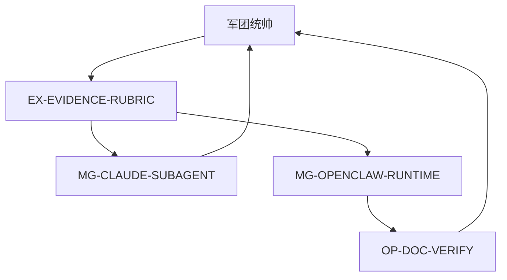

# DAG · EP · I/O — LEGION-TOOL-AGENT-ANALYSIS-20260330

**CHAIN**：`LEGION-TOOL-AGENT-ANALYSIS-20260330`  
**冻结时间**：2026-03-30

---

## 1. DAG 邻接表（有向无环）

| -from- | -to- | 说明 |
|--------|------|------|
| 军团统帅 | EX-EVIDENCE-RUBRIC | EP-0 |
| EX-EVIDENCE-RUBRIC | MG-CLAUDE-SUBAGENT | EP-1 支路 1 |
| EX-EVIDENCE-RUBRIC | MG-OPENCLAW-RUNTIME | EP-1 支路 2 |
| MG-OPENCLAW-RUNTIME | OP-DOC-VERIFY | EP-2（仅 OpenClaw 核对链） |
| MG-CLAUDE-SUBAGENT | 军团统帅 | EP-1 收口（无架构内下级，直接汇流统帅） |
| OP-DOC-VERIFY | 军团统帅 | EP-2 收口 |

**拓扑波次**

- **EP-0**：EX-EVIDENCE-RUBRIC  
- **Gate 0→1**：EX《逐级主题汇流块》齐备（证据分级 + 约束块）  
- **EP-1**：MG-CLAUDE-SUBAGENT ∥ MG-OPENCLAW-RUNTIME  
- **Gate 1→2**：MG-OPENCLAW-RUNTIME 产出已具备 OP 输入最小集（机制说明 + 官方 URL 列表）  
- **EP-2**：OP-DOC-VERIFY（可与 MG-CLAUDE 汇流统帅**并行**编排，但 DAG 上 OP 仅依赖 MG-OPENCLAW）  
- **Gate 2→回声**：OP 关门稿齐备；统帅完成 `ECHO-CHECK.md` P0

---

## 2. EP 执行简表

| EP | 并行节点 | Gate |
|----|----------|------|
| EP-0 | EX-EVIDENCE-RUBRIC | G0→1 |
| EP-1 | MG-CLAUDE-SUBAGENT ∥ MG-OPENCLAW-RUNTIME | G1→2 |
| EP-2 | OP-DOC-VERIFY | G2→回声 |

**并发**：单波 L3 Task ≤4（本链最多 2 并行，满足规则）。

---

## 3. I/O 契约

| 生产者 | 消费者 | 输出物（格式） | 最小字段 |
|--------|--------|----------------|----------|
| 军团统帅 | EX-EVIDENCE-RUBRIC | 军令状路径 + 原始需求指针 | CHAIN、MISSION-BRIEF 路径 |
| EX-EVIDENCE-RUBRIC | MG-CLAUDE-SUBAGENT / MG-OPENCLAW-RUNTIME | 证据汇流块 | A/B/C 规则、禁止项、Claude/OpenClaw 分别的注意点 |
| MG-OPENCLAW-RUNTIME | OP-DOC-VERIFY | OpenClaw 机制草案 | 声称条款列表 + 每条对应 docs.openclaw.ai 路径 |
| MG-CLAUDE-SUBAGENT | 军团统帅 | Claude 轨道汇流块 | 拓扑结论（B 标注）、多启示例步骤或伪代码 |
| OP-DOC-VERIFY | 军团统帅 | 核对结论 | P0 覆盖表、漏项、与官方文档一致性（A/B） |

---

## 4. Task 预算

| 波次 | L3 节点数 | 备注 |
|------|-----------|------|
| EP-0 | 1 | EX |
| EP-1 | 2 | 双 MG |
| EP-2 | 1 | 叶 OP |

**说明**：首轮主会话已产出与②对齐的长文汇流时，可将该汇流**摘要指针**写入 `artifacts/`，后续 EP Task 以**最小充分信息**重放或增量核对，避免重复全文。

---

## 5. Mermaid（可选渲染）

