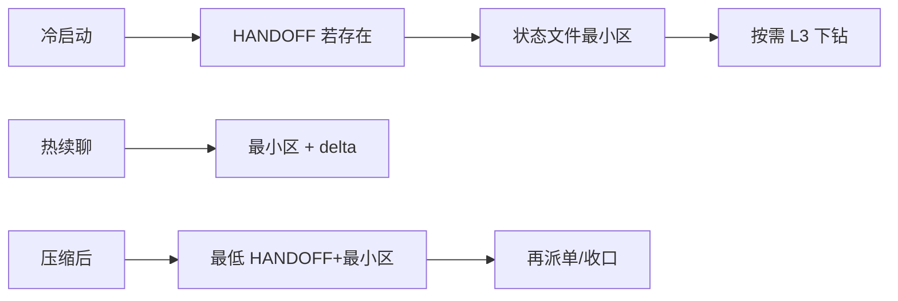

# 渐进式记忆（泛化移植版）

> **与 `PORTING-PROMPT-PROGRESSIVE-MEMORY-ASK.zh-CN.md` 为同一套泛化正文**（含 **§2.1 执行大环境**）。外机复制任选其一即可；本仓维护时**请两处同步修改**，以免分叉。
>
> 下文标题沿用「渐进披露记忆 · Ask 回合…」以便与 PORTING 文件名语义对齐。

---

# 渐进披露记忆 · Ask 回合窗口消费 · 通用移植提示词

> **⚠️ 效力范围（必读）**  
> 本文件**单独复制到外机**不等于自动获得宿主侧的 Sub-agent 闸门、写码回合验收、或军团 Phase Gate。  
> 仅当目标环境已定义**等价纪律**（谁写外存、谁 Read、何时禁止仅凭聊天梗概派单/收口）时，下列流程才对助手有约束力。  
> **本仓库权威条款**：`CLAUDE.md §二`（记忆接力 Read 序）、技能 **`22_主帅上下文生命周期管理.md` §12.4**；本文是**宿主无关摘要 + 可复制块**。  
> 与 **XWM / 记忆接力** 配套：`.claude/swarm/PORTING-PROMPT-XWM.zh-CN.md`、`.claude/swarm/记忆接力提示词.md`。

---

## 0. 解决什么问题

| 问题 | 本提示词给的解法 |
|------|------------------|
| 主会话 token 膨胀、Summarize 后「像还记得其实没对齐盘」 | **渐进披露**：默认只持薄骨架；按**冷热与是否压缩**递进 **Read** 外存。 |
| 用户一轮提问（Ask）就想续干 | 明确 **Ask 回合**不改变宿主其它门禁；只约束**本轮先消费哪几层外存**。 |
| 多份文档各说各话 | **单一 L2 锚**（见 §2）+ **军令状/章程类文件**在冲突时的优先规则（见 §2）。 |
| Summarize / 下一波 WAVE 后「环境变量、路径像丢了」 | **执行大环境**须**预先落盘**（见 §2.1）；记忆接力只读文件，**不恢复从未写入盘中的聊天句**。 |

---

## 1. 宿主最小配置（复制到 README 或规则并填路径）

| 占位符 | 含义 | 填表示例 |
|--------|------|----------|
| `{STATE_ROOT}` | 治理/状态根目录 | `.claude/swarm` |
| `{CHAIN_ID}` | 当前任务链标识 | `PROJ-FEATURE-001` |
| `{CHAIN_DIR}` | 单链目录（蜂群式） | `{STATE_ROOT}/chains/{CHAIN_ID}` |
| `{LEGION_CHAIN_DIR}` | 单链目录（军团式，可选） | `{STATE_ROOT}/legion/chains/{CHAIN_ID}` |
| `{FILE_HANDOFF}` | 会话切割稿 | `{CHAIN_DIR}/HANDOFF-R{N}.md`（军团则换为 `{LEGION_CHAIN_DIR}`） |
| `{FILE_STATE}` | 链状态主文件 | `{CHAIN_DIR}/CHAIN-STATE.md` |
| `{SECTION_MINIMAL}` | 主文件内**最小摘要区**（如前 20 行或固定小节名） | 由模板约定 |
| `{FILE_DECISIONS}` | 跨链简报 | `{STATE_ROOT}/RECENT-DECISIONS.md` |
| `{FILE_L1_MIRROR}` | L1 草稿镜像（可选） | `{CHAIN_DIR}/L1-MIRROR.md` |
| `{DIR_TASK_REFLUX}` | 子任务回流摘要（可选） | `{CHAIN_DIR}/task-reflux/` |
| `{FILE_CHARTER}` | 军令状/章程/需求穿透（可选） | `{LEGION_CHAIN_DIR}/MISSION-BRIEF.md` 或宿主自定 |

**CHAIN_ID**：未给出时助手须**一句追问**，或从 HANDOFF / 状态文件抬头推断（推断标 **B**）；禁止无链标识跨链盲读。

---

## 2. 三层披露与权威（泛化版 · 勿与「路由分层」混名）

下列 **L1 / L2 / L3** 表示**上下文消费深度**，与某些宿主文档里的 **「L0–L3 触发分层 / 话术路由」** 是**不同命名空间**；移植时请二选一写清，或显式写「无关」。

| 层 | 典型内容 | 默认进主窗 |
|----|-----------|------------|
| **L1** | 当轮对话、口令、薄摘要 | 多 |
| **L2** | `{FILE_STATE}` 的最小摘要区 + 冻结条/delta 等 | **少而硬**（目标句、进行中的 P0、裁决、轮次） |
| **L3** | `{FILE_DECISIONS}`、章程全文、`artifacts/`、历史收口包 | **按需 Read** |

**权威序（推荐）**

1. **链上 L2**：`{FILE_STATE}` 为该链**可复核进度**的主锚（以宿主模板为准）。  
2. **章程/军令状**：若宿主有 `{FILE_CHARTER}` 或穿透节，与 L2 指针**一致**时，优先于口头汇流、聊天梗概、本提示词的复述。  
3. **冲突**：以**落盘 Read 结果**为准；禁止静默合并矛盾前提。

**可选（军团向）**：在 L2 元数据维护 **pinned 档位**（如 `full` / `skeleton` / `id-only`），按主窗预算控制章程进窗量；恢复全文时 **Read** 回 L3 文件。

### 2.1 执行大环境落盘（军令状体系 · 与渐进披露 / WAVE 接力配套）

下列内容共同构成**规定产出与操作的大环境基础**；**禁止仅写在聊天里**指望 Summarize 或记忆接力自动找回。

| 类别 | 示例（非穷尽） | 推荐落点（择一或组合，须可 Read） |
|------|----------------|-------------------------------------|
| **仓库与工作区** |  monorepo 子包路径、工作区根、关键 `cwd` 约定 | `{FILE_CHARTER}` **附录**「执行环境」表；或 `{FILE_HANDOFF}` 元块；或 `{FILE_STATE}` 最小区 **一行指针** → `README` / `docs/DEV.md` |
| **关键 ENV** | 构建/运行依赖的变量**名**、profile、开关；**非密钥取值** | 军令状附录表 + **指针** → `.env.example` / 宿主 CI 文档；**禁止**把真实密钥写入仓库 |
| **容器 / 运行时** | 镜像名与 tag、Compose 服务名、K8s namespace、devcontainer 配置路径 | 同上附录或指针 → `docker-compose.yml` / `.devcontainer/` |
| **跨波次不变量** | 上一波 WAVE 已冻结仍适用于下一波的路径与 ENV 约定 | 收口包 / Gap 闭环节 **显式 carry-over** + 军令状附录同步修订或版本指针 |

**纪律**

1. 主帅 / 统帅在冻结军令状或结束一波时，须核对：**附录（或等价节）是否已覆盖本链操作所需的大环境**；缺则**补写或补指针**再签 Gate / 开下一波。  
2. **记忆接力第 5 步** Read `{FILE_CHARTER}` 时，应能直接看到上述附录或指针；**未落盘则视为链上形状缺口**，须在汇流标 **B** 或阻塞直至补齐（由宿主规则定严宽）。  
3. 与 **HANDOFF** 关系：切割会话时，若大环境相对军令状**无变更**，HANDOFF 可只写 **「大环境见 MISSION 附录 §x」**；若有**变更**（如新仓库根），HANDOFF **必须**写清 delta，避免只读军令状旧版。

---

## 3. Ask 回合（定义）

**Ask 回合**：用户向**主编排助手**发起的一轮提问（含口令、续干、或纯答疑）。  
本概念**不替代**宿主侧的写码验收、子代理时序等；只约束：**在派下游或宣布收口之前，是否已按 §4 读过外存**。

---

## 4. 记忆接力 · 强制 Read 序（算法 · 与文件名解耦）

下列顺序为**逻辑序**；路径用 §1 替换。在**派发实现类 Task、关闭验收、或宣布 PASS/FAIL** 之前完成（宿主可收紧）。

1. **`{FILE_HANDOFF}`（若存在）** — 多份时默认 **序号最大**，除非用户指定。蜂群/军团目录按宿主约定二选一。  
2. **`{FILE_STATE}` 的 `{SECTION_MINIMAL}`** — 无状态主文件时：首段声明并据 `{FILE_DECISIONS}` + 用户补述**降级**；**禁止虚构**已冻结事实。  
3. **（可选）** `{FILE_L1_MIRROR}` 最近一轮块；`{DIR_TASK_REFLUX}` 与当前任务相关的摘要。  
4. **（按需）** `{FILE_DECISIONS}` 中与 `{CHAIN_ID}` 或主题相关的**最新**条目。  
5. **（若启用军团/章程）** `{FILE_CHARTER}` 及本轮相关的穿透节；与宿主 **Gate 放行前安检**叠加，**不互相替代**。

**说明**：规程上**不是**「先全文读军令状」。**上一波进度、切割接力**多在第 1～2 步（HANDOFF + 状态最小区）；**初始目标与条文级穿透**在第 **5** 步补齐。若业务要求「尽快对齐章程」，仍应先完成 1～2，再 deep-read 第 5，避免跳过链 ID 与状态锚。

---

## 5. 冷热与 IDE 压缩（与 §4 对齐）

| 模式 | 建议行为 |
|------|----------|
| **冷启动**（新会话、换窗、不确定链） | 执行 **§4 全序**（至少 1+2；无 HANDOFF 则从 2 起）。 |
| **热续聊**（同链、状态已在窗或刚更新） | 优先 **Read** 状态最小区 + **本轮 delta**；**不**等于可永久跳过状态文件维护义务。 |
| **IDE Summarize / 上下文压缩后** | **视同**须执行与「记忆接力」**等价的 Read 纪律**；至少 **HANDOFF（若有）+ 状态最小区**；**禁止**仅凭压缩梗概派单或收口。口令「记忆接力」可显式触发同一纪律。 |

**重要**：Summarize 由用户在 **IDE 内**操作；口令只约束助手**之后的 Read**，不承诺代替点击总结。



---

## 6. 链状态模板可选字段（与本仓对齐 · 可选移植）

在状态文件最小区可增**可选**一行：**open 条件计数**（若宿主有 COND 类机制），并注明上限与溢出处理指针（本仓为技能 `22` §10）。**禁止**用可选字段替代完整 COND 表或突破宿主硬上限。

---

## 7. 可复制提示词块

### 7.1 给最终用户（贴在需求末尾）

```text
【记忆接力 / 压缩后对齐】CHAIN_ID=<填写>。
请按宿主约定顺序读取外存：HANDOFF（若有）→ 链状态最小区 →（若有）L1 镜像与 task-reflux →（按需）裁决简报 →（若军团/章程）MISSION 或等价文件相关节（含执行大环境附录：仓库根/路径/ENV 名与指针/容器约定）。读完再派工或下验收结论。禁止仅凭聊天梗概宣称已对齐。
```

### 7.2 给主编排助手 / Agent

```text
用户要求对齐外置记忆或处于 Summarize 后续聊。本轮第一步：按 STATE_ROOT / CHAIN_DIR 完成 Read 序 §4；不得在未读状态最小区的情况下派发实现类任务或宣布 PASS。
渐进披露：L1 对话 → L2 状态锚 → L3 全文按需；勿与宿主「路由分层 L0–L3」代号混用（若存在）。
读军令状时核对「执行大环境」附录（或 HANDOFF/链状态指针）：仓库根、关键路径、ENV 名与文档指针、容器约定须已在盘内，不得假设仅聊天说过即有效。
```

---

## 8. 与本仓库文件的映射（附录 · 移植后可删）

| 概念 | 本仓库路径 |
|------|------------|
| Ask + 渐进披露正文 | `.claude/skills/hajimi-dog/03_AI行为准则/22_主帅上下文生命周期管理.md` §12.4 |
| 记忆接力宿主版 | `.claude/swarm/记忆接力提示词.md` |
| 强制 Read 序（条文） | `CLAUDE.md §二`「记忆接力」 |
| 状态模板 | `.claude/swarm/chains/_CHAIN-STATE-TEMPLATE.md` |
| 升级记录（2026-03-30） | `.claude/swarm/蜂群体系升级记录.md` |
| 军令状与穿透（宿主军团） | `.claude/skills/hajimi-dog/03_AI行为准则/19_军团模式军令状与信息穿透.md` |
| 双文件正文（与本文件一致） | `.claude/swarm/PORTING-PROMPT-PROGRESSIVE-MEMORY-ASK.zh-CN.md` |

---

**版本摘要**

- **2026-03-30（初版）**：Ask 回合、渐进披露、冷热路径、压缩后等价纪律、记忆接力 1～5 序、章程第 5 步，泛化为宿主占位符。  
- **2026-03-30（修订）**：增 **§2.1 执行大环境落盘**——关键 ENV（名与指针）、仓库根/路径、容器约定等须进军令状附录或 HANDOFF/链状态指针，**禁止仅聊天**；与 Summarize / 下一波 WAVE 接力对齐。  
- **2026-03-30（别名文件）**：本文件 **`渐进式记忆.md`** 与 **`PORTING-PROMPT-PROGRESSIVE-MEMORY-ASK.zh-CN.md`** 正文对齐，供中文检索；维护须双改。
